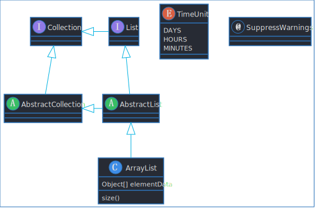

# PlantUML One Dark Theme

Modified from [CF Color Theme](https://github.com/go-zen-chu/plantuml_cf_theme)

# How to use

## Vscode

- 下载PlantUML扩展
- 将repo下载到本地，并将文件夹加入扩展的`includepaths`设置中
- ~~添加`"-config theme.planuml"`到扩展的`jarArgs`设置中~~
    - 现版本`2.14.5`有bug，添加`"-c!include theme.plantuml"`可正常工作

## Obsidian

- 下载PlantUML社区插件
- 插件设置`Header`中填写
    - `!include https://raw.githubusercontent.com/IshmaelHeathcliff/plantuml_theme/master/plantuml_theme.txt`
- 推荐与主题[OneDarkTopaz](https://github.com/IshmaelHeathcliff/OneDarkTopaz_Obsidian-css)一起使用
